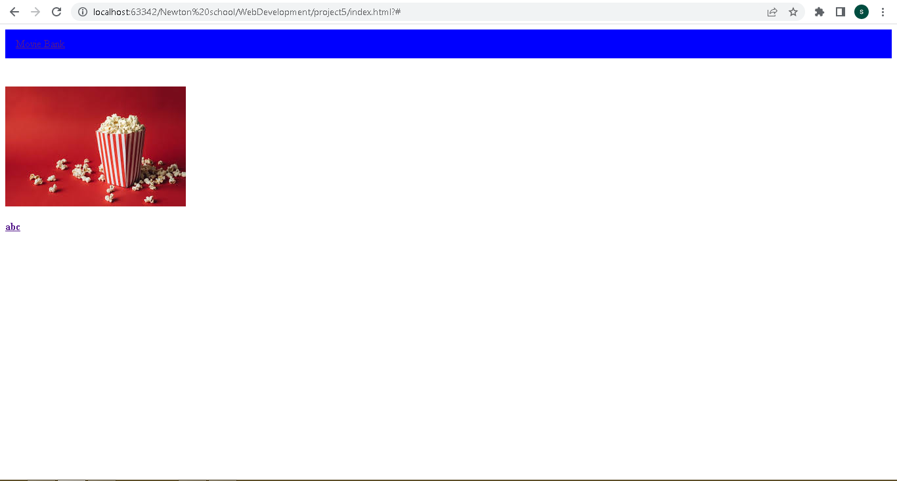
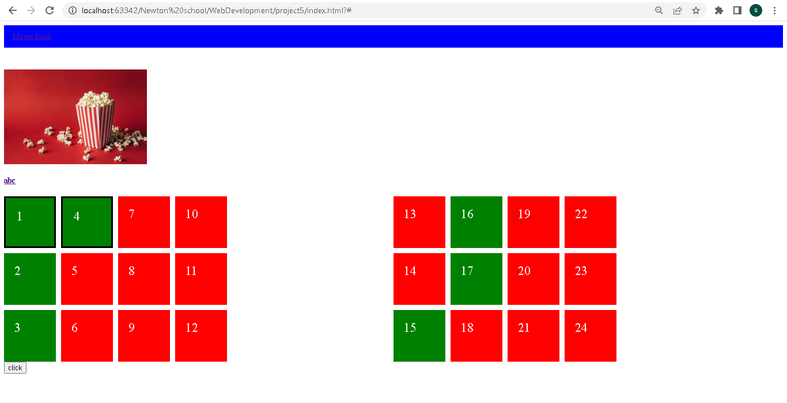
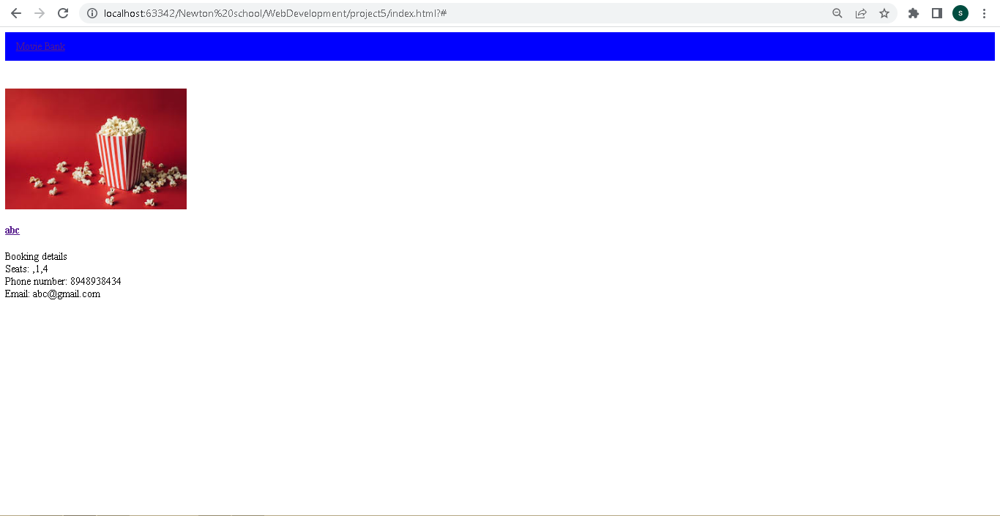

Hosted on : 

1.Write the project description
In this project i have made a UI design for Movie Ticket System .

2.WHY this project was chosen
I have choosen this project because there is lot to learn from this project related to html and css and javascript property

3.HOW did you make the project.
I have used HTML and CSS for UI design. With the help of different tags i have created
different section using flex-box and used different property to arrange the content in UI design.

4.WHAT features, technical things you had implemented.
I have used flexbox to assign div elements using flexbox property
such as justify-content:space-between,flex-direction:column etc.
I have used fetch to call the url of json file then i used response to 
extract the relevant information and populate the seating arrangement based 
on availability of seats user interact and book ticket which is later displayed on screen.
